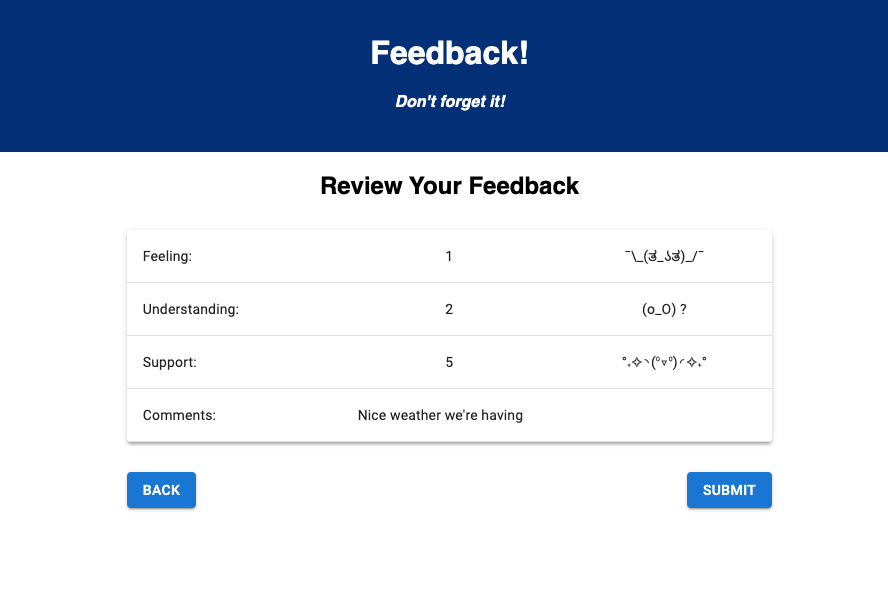
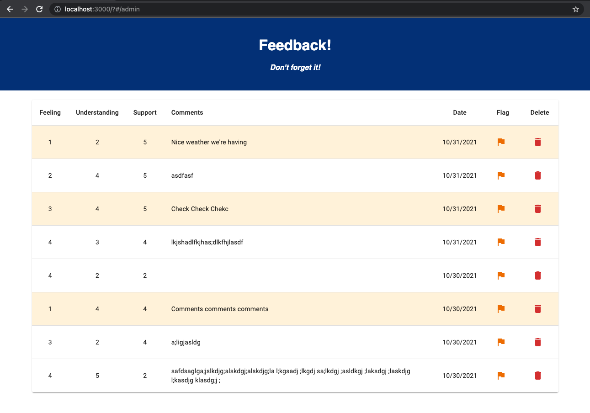

### Full-stack Feedback SPA

## Description

*Duration: 3 Day Task*

A full-stack full-crud single page app for collecting, submitting, and viewing feedback responses.

As many of the pages share similar structure, I challenged myself to use a single dynamic Form component for each of the views that collect user input. This required some additional logic and conditional formatting, but ended up saving me a lot of time when it came to editing, standardizing, and introducing Material UI components in each view.

## Screenshot

## Prerequisites

- Node.js
- PostgreSQL (and client app)

## Installation

1. Clone repo
2. Open in code editor and run `npm install`
3. Use instructions and queries in data.sql to initialize database
4. Run `npm run server` and `npm run client`in your terminal
5. The `npm run client` command will open a browser tab with the project

## Usage

1. Select a number of stars to respond to the question prompt
2. Press 'Next' button to proceed to the next prompt
3. Use the 'Back' button to view and edit previous responses
4. After responding to the prompts, a summary page will allow you to review your responses before submitting them
5. On clicking 'Submit', a final page will confirm your submission and provide the option to begin a new submission
6. Admins can navigate to the `/admin` page to view the responses
7. Clicking on the flag icon will update the database and highlight the response on the admin page
8. Clicking the trash icon will remove the response from the database

## Built With

- Express.js
- React.js
- Redux
- Material UI
- node-postgres

## Acknowledgements

Thanks to my instructors and peers at [Prime Digital Academy,](primeacademy.io) who taught me the skills to make this project a reality!

## Support

Please email me at rutherford.t.b@gmail.com if you have any questions, comments, or suggestions!
